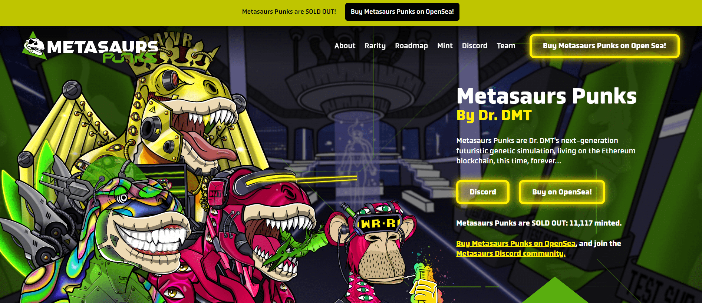

# Metasaurs Punks by Dr. DMT

Metasaurs 朋克已售罄！铸造了 11,117 个 Metasaurs Punks。在 OpenSea 上购买 Metasaurs Punks！
DMT 博士是谁？我是来自 Bored Ape 游艇俱乐部的正宗无聊猿，原名 BAYC Ape #4588，  Metasaurs 的创建者， Metasaurs是历史上发展最快、最热情的 NFT 社区之一。

我在实验室很忙，Metasaurs Punks 是我的下一代未来主义 Metasaurs 系列！

你以为那是我背心上的芥末？这实际上是我在实验室实验中的 MetaDNA 化学物质。我是元科学家，他对最初的9,999 条独特的元龙进行了基因工程。

你可以叫我DMT博士。

自从恐龙出现以来，已经有 6500 万年了。无聊的猿也需要同伴。#BAYC #dmtgang #Metasaurs 可以生活在一起，也许我们作为一个社区在一起会不那么无聊。

