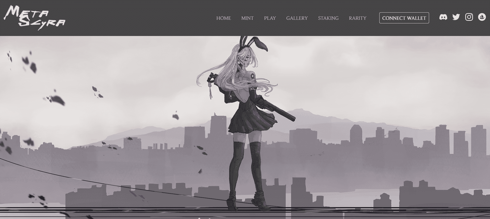

# MetaScyra Origins

海浪亲吻悬崖的声音，风抚摸草叶的声音，海鸥对云的鸣叫，所有这些都在亚马逊女王希波吕忒的耳边编织了一首日常交响乐。她常常站在悬崖边，有时闭着眼睛，今天睁开眼睛，望向远方，连海浪的变化都无法抚慰她，因为风中又有了新的声音。危险。

一群有权有势的人正在寻求做人类世界中所有人都在寻求的事情。控制。这一次，控制元界。他们很快就会被称为中央集权。听到这个威胁，亚马逊人来到赫菲斯托斯的熔炉，建造了铁砧，一台能够将他们的身体运送到元宇宙的机器。

一支由 6,666 名最勇敢的亚马逊人组成的队伍踏上征程，建立了一个新家。MetaScyra，以他们的天堂岛 Themiscyra 命名。从这里开始，现在的 MetaScyrans 将与 Metaverse 中的盟友联系，建立一支军队，以阻止威胁集中分散的权力。只有团结一致，我们才能真正打造我们所希望的乌托邦元宇宙。

