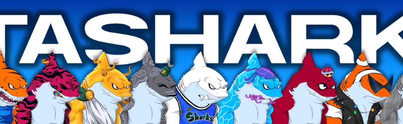

# MetaSharksNFT

MetaSharksNFT NFT - 常见问题（FAQ）
▶ 什么是 MetaSharksNFT？
MetaSharksNFT 是一个 NFT（Non-fungible token）集合。存储在区块链上的数字艺术品集合。
▶ 存在多少 MetaSharksNFT 代币？
总共有 3,337 个 MetaSharksNFT NFT。目前，653 位所有者的钱包中至少有一个 MetaSharksNFT NTF。
▶ 最近卖出了多少 MetaSharksNFT？
过去 30 天内售出了 1 个 MetaSharksNFT NFT。
▶ 什么是流行的 MetaSharksNFT 替代品？
许多拥有 MetaSharksNFT NFT 的用户还拥有 RP WOLVES GENESIS、 STEEZY MUSIC、 BRYAN VEE ORIGINALS和 RPCollective。

