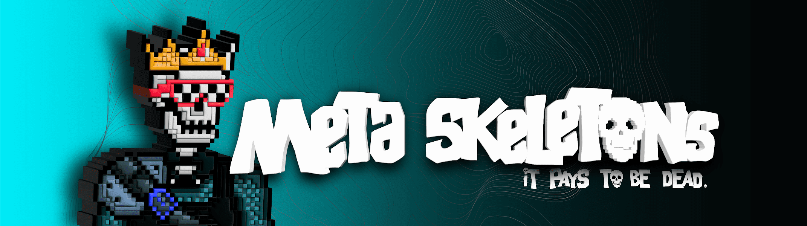

# Meta Skeletons 2D

**什么是Meta Skeletons 2D？**

Meta Skeletons 2D元骨架是5，555个独特的2D / 3D NFT社交化身骨架，准备接管元宇宙并分割战利品。

每个骨架都是独一无二的，具有200多个独特的特征和算法生成的属性。

它们都有自己独特的外观。有些很奇怪，有些是疯狂的，有些很酷。但他们的一个共同点是，他们都看起来像h*ll。骨架存储在以太坊区块链上。

第一阶段已售罄。

