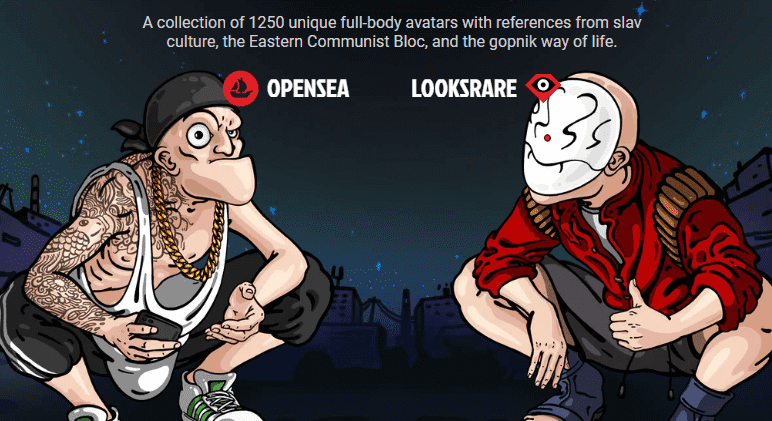

# MetaSlavs

MetaSlavs 是 1250 个独特的全身化身的集合，其中参考了斯拉夫文化、东方共产主义集团和 gopnik 生活方式。

▶ 什么是 MetaSlavs？
MetaSlavs 是一个 NFT（Non-fungible token）集合。存储在区块链上的数字艺术品集合。
▶ 存在多少 MetaSlavs 代币？
总共有 1,250 个 MetaSlavs NFT。目前 449 位所有者的钱包中至少有一个 MetaSlavs NTF。
▶ 最近卖出了多少台 MetaSlav？
过去 30 天内售出 0 个 MetaSlavs NFT。
▶ 什么是流行的 MetaSlavs 替代品？
许多拥有 MetaSlavs NFT 的用户还拥有 Geisha Tea House、 Ascended NFT Official、 The Mood Octopus和 RTFKT-MNLTH。

