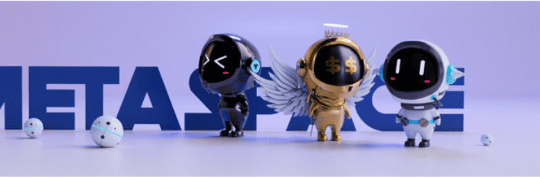

# MetaSpace Golden NFT

作为 MetaSpace Golden NFT 的 88 个 3D 动画合集。直接享受未来孵化项目收益分成，全是被动收益！

MetaSpace Golden NFT NFT - 常见问题（FAQ）
▶ 什么是 MetaSpace 黄金 NFT？
MetaSpace Golden NFT 是一个 NFT（Non-fungible token）集合。存储在区块链上的数字艺术品集合。
▶ 存在多少 MetaSpace Golden NFT 代币？
总共有 29 个 MetaSpace Golden NFT NFT。目前 25 位所有者的钱包中至少有一个 MetaSpace Golden NFT NTF。
▶ 最昂贵的 MetaSpace Golden NFT 销售是什么？
最昂贵的 MetaSpace Golden NFT NFT 是 MetaSpace Golden NFT #3。它于 2022-06-17（2 个月前）以 329.3 美元的价格售出。
▶ 最近卖出了多少 MetaSpace Golden NFT？
过去 30 天内售出 1 个 MetaSpace Golden NFT NFT。

