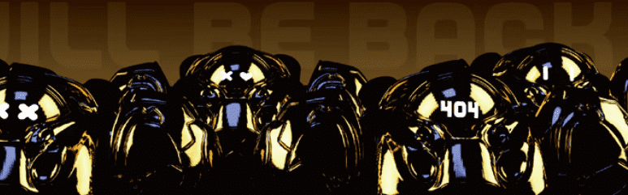

# Metaspace_Golden

888 Meatspace 黄金生活在以太坊区块链中。// 888 独特的 3D 集合作为 MetaSpace Genesis NFT。不仅是 PFP，而且是 PassCard 和孵化器！1.Freemint- TOOL Metazoan-15% 收益分成 2.Freemint 下一个项目 Lover NFT-25% 收益分成 3.Mint 折扣-未来其他艺术品-8% 收益分成 4.Mint 折扣-更多艺术品、工具项目在未来 8% 的收益分成

Metaspace_Golden NFT - 常见问题（FAQ）
▶ 什么是 Metaspace_Golden？
Metaspace_Golden 是一个 NFT（非同质代币）集合。存储在区块链上的数字艺术品集合。
▶ 存在多少 Metaspace_Golden 代币？
总共有 888 个 Metaspace_Golden NFT。目前 812 位所有者的钱包中至少有一个 Metaspace_Golden NTF。
▶ 最昂贵的 Metaspace_Golden 销售是什么？
售出的最昂贵的 Metaspace_Golden NFT 是 toogle meta space genesis #577。它于 2022-06-26（2 个月前）以 20.9 美元的价格售出。
▶ Metaspace_Golden 最近卖出了多少？
过去 30 天内售出了 26 个 Metaspace_Golden NFT。
▶ Metaspace_Golden 需要多少钱？
过去 30 天，Metaspace_Golden NFT 最便宜的销售额低于 6 美元，最高销售额超过 18 美元。Metaspace_Golden NFT 的中位价格在过去 30 天内为 11 美元。
▶ 什么是流行的 Metaspace_Golden 替代品？
很多拥有Metaspace_Golden NFTs的用户也拥有 MONA CAKE、 NOT Aurary、 Dodo的简单笔画和 我是Nobody。

