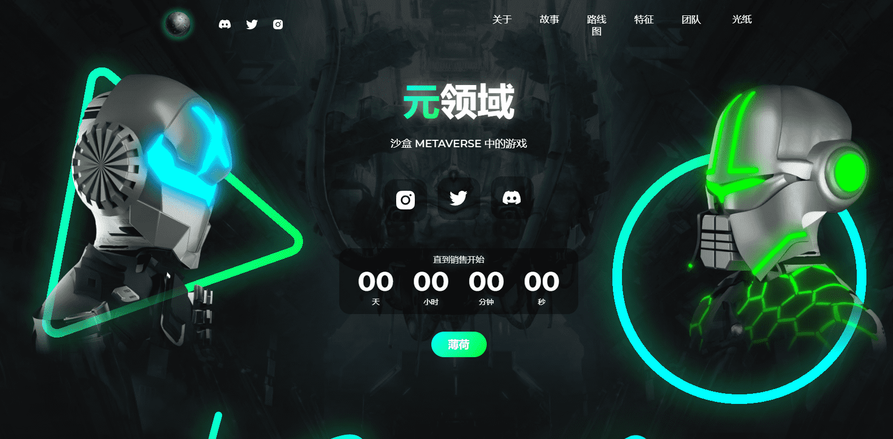

# Metasphere (Official)

一个独特的 3D NFT 集合，包含 3,333 个半机械人，按稀有程度分类并由数百个元素生成。

每个 cyborg 都可以让您访问我们的 P2E 游戏、MetasphereDAO 和 Sandbox Metaverse。

在我们的宇宙之初，只有一个二维世界，一个平面世界，居住着被称为奉承者的人。这个世界已经存在了数千年。技术并没有让他们落后。首先，他们学会了如何使用长矛和弓来生火并为自己获取食物。然后他们发明了轮子和帆。然后一件事导致了另一件事。技术的复杂性和改进迅速增加，每一个奉承者都会产生大量的东西。随着时间的推移，他们面临的问题永远改变了他们的世界观并导致了 Metasphere，这是一个由机器人居住的未来主义 3D 宇宙。

