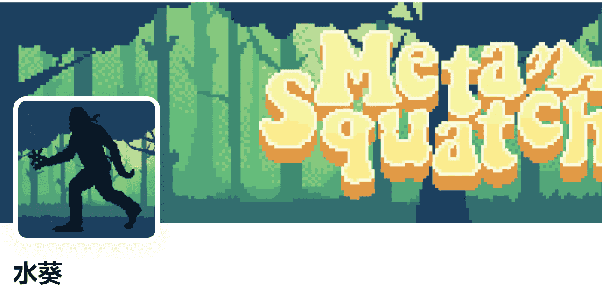

# METASQUATCH

550 只双足、类人猿、像素化生物据说栖息在北美森林和元宇宙最黑暗的区域。

据报道，它会谨慎移动以避免与人接触。非常谨慎的方法！！！！！！！免费薄荷！！！！

潜伏越来越近了.. 介绍一位刽子手！谁感到幸运？密切关注不和谐...

什么是 METASQUATCH？

METASQUATCH 是一个 NFT（不可替代代币）集合。存储在区块链上的数字艺术品集合。

METASQUATCH 代币有多少？

总共有 550 个 METASQUATCH NFT。目前，240 位所有者的钱包中至少有一个 METASQUATCH NTF。

最近卖出了多少 METASQUATCH？

过去 30 天内售出 0 个 METASQUATCH NFT。

