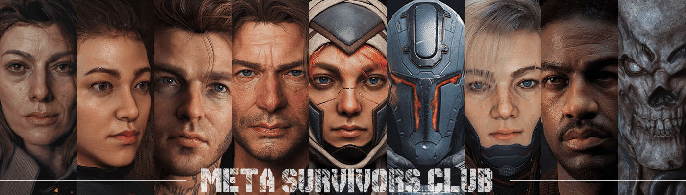

# Meta Survivors Club

Meta Survivors Club 是在以太坊区块链上注册的逼真的 3D 角色 NFT。该系列包含 8 个原始人类角色。让我们一起生存！

Meta Survivors Club NFT - 常见问题（FAQ）
▶ 什么是元幸存者俱乐部？
Meta Survivors Club 是一个 NFT（非同质代币）集合。存储在区块链上的数字艺术品集合。
▶ 存在多少 Meta Survivors Club 代币？
总共有 500 个 Meta Survivors Club NFT。目前 226 位所有者的钱包中至少有一个 Meta Survivors Club NTF。
▶ Meta Survivors Club 最贵的销售是什么？
最昂贵的 Meta Survivors Club NFT 是 Meta Survivors Club。它于 2022-06-11（3 个月前）以 61.4 美元的价格售出。
▶ Meta Survivors Club 最近卖出了多少？
过去 30 天内售出了 9 个 Meta Survivors Club NFT。
▶ 什么是流行的 Meta Survivors Club 替代品？
许多拥有 Meta Survivors Club NFT 的用户还拥有 One Eye Baby Creating the World、 8 HANABI-Genesis、 Longimals和 Meta Joseon。

