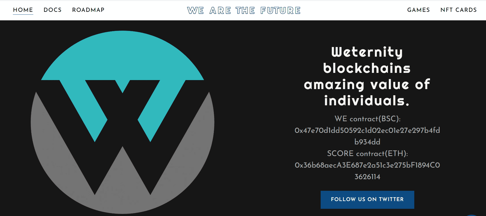

# MetaThreeStar

MetaThreeStar 是什么时候创建的？

MetaThreeStar 于 2022 年 8 月 27 日首次铸造。

有多少 MetaThreeStar 代币？

我们还没有流通供应，请稍后再回来查看！

MetaThreeStar 有多少特征？

我们为 MetaThreeStar 索引了 36 个独特的特征对。

我在哪里可以买到 MetaThreeStar？

购买 MetaThreeStar 最常见的地方包括 OpenSea 和 LooksRare 等市场或 Gem.xyz 和 Genie.xyz 等聚合器。链接可以在上面找到！

