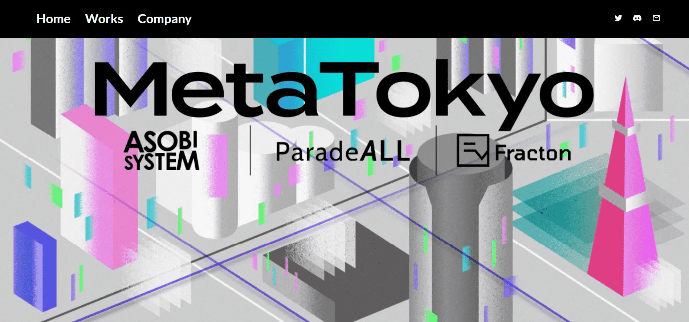

# MetaTokyo Pass Gen 1.0

这是世界上第一个连接NFT的项目，它正在全球范围内扩大新的文化和娱乐的分布，区块链是它的技术基础，以及Web3运动，它实现了一种新的社会、文化和城市方式。

这是世界上第一个将正在全球范围内扩大新文化和娱乐分布的 NFT 及其技术基础、区块链和实现新社会方式的 Web3 运动与文化和城市连接起来的项目。

一个随着音乐起舞的巨型“Metaani x Kyary Pamyu Pamyu”已经出现在全球元宇宙平台“Decentraland”上。
世界各地的用户都可以体验到在现实世界中无法实现的世界观，这是元界独有的。

在 Decentraland 全球元界平台上，随着音乐翩翩起舞的巨型“Metaani x Kyary Pamyu Pamyu”出现，来自世界各地的用户可以体验到现实生活中不可能实现的世界观，这是元界独有的。

