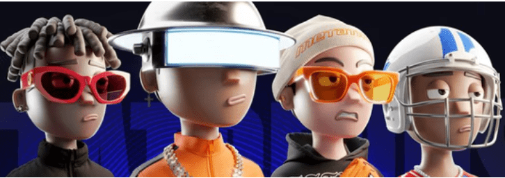

# MetaTrends NFTs

新的或二手的。 运动鞋或鞋子。 尖顶帽或巴拿马。 品牌或破布。 不管你从哪里得到它，最重要的是你看起来很酷。 你为街头时尚设定了新标准。 给你！

我们都厌倦了相同和重复的图像。 Metatrends 是一种完全不同的时尚。 由最酷的 Dopebroky Daniel 创建，他的图像不仅在我们的世界中，而且在元世界中都颠倒了一切。

每个人都厌倦了强加的流行趋势。 每个人都想成为个人、特别、独特和酷。 加入我们的地下文化 Metatrends，参与伟大事物的诞生。 我们相互认同，我们的社区是这种文化的基础。

我们喜欢这个项目，并为我们的工作感到自豪，所以我们不需要在电视上展示。 我们穿好衣服出门。

你在我们中间。

