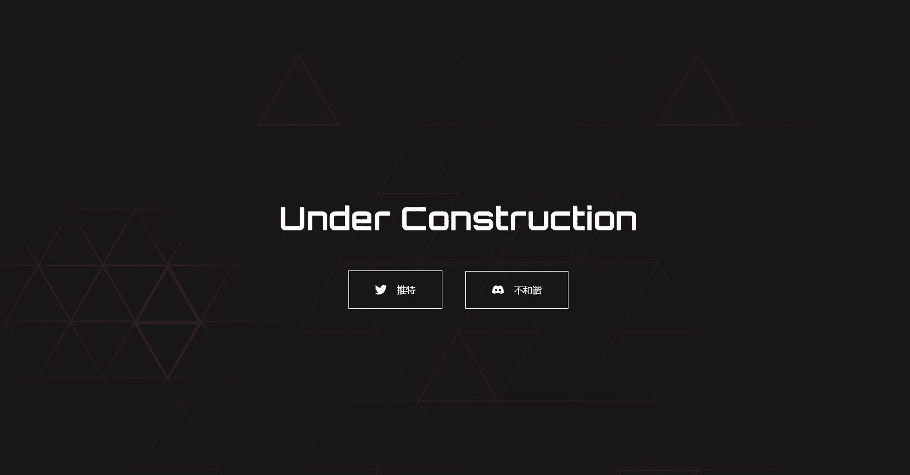

# Meta Triads

元界时尚的未来，Meta Triads NFT 在过去 7 天内售出 10 次。Meta Triads 的总销售额为 531.99 美元。一个 Meta Triads NFT 的平均价格为 53.2 美元。共有 679 个 Meta Triads 所有者，总共拥有 2,383 个代币。

什么是元三合会？

Meta Triads 是一个 NFT（非同质代币）集合。存储在区块链上的数字艺术品集合。

存在多少 Meta Triads 代币？

总共有 2,383 个 Meta Triads NFT。目前，679 位所有者的钱包中至少有一个 Meta Triads NTF。

最昂贵的 Meta Triads 销售是什么？

出售的最昂贵的 Meta Triads NFT 是 [MetaTriad #1473](https://www.nft-stats.com/asset/0xe2889645716c27194b75484eb7150f9c9ddd824c/1473)。它于 2022 年 6 月 12 日（3 个月前）以 215.2 美元的价格售出。

最近卖出了多少元三合会？

过去 30 天内售出了 44 个 Meta Triads NFT。

