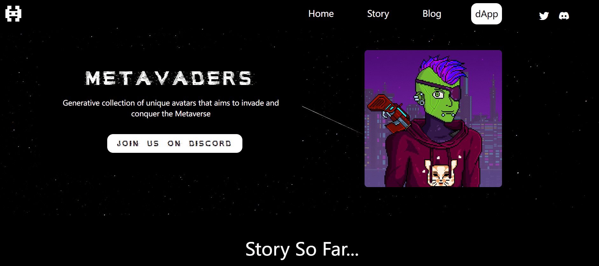

# Metavaders V2

Metavaders是多行星物种地球的最后幸存者，在它因核战争和食物供应枯竭而变得无法居住之前。

Metavaders 在银河系中无休止地游荡，然后偶然遇到了军团，这是一个技术先进的物种，他们提议 Metavaders 加入他们的事业 - 被上传到 Metaverse 并征服其中存在的所有世界。

为了他们的持续可持续性，Metavaders 入侵并捕获外国世界的居民以换取资源。

他们已经将目光投向了他们的第一个入侵目标 Animetaverse。入侵已经开始，事情并没有按计划进行……

