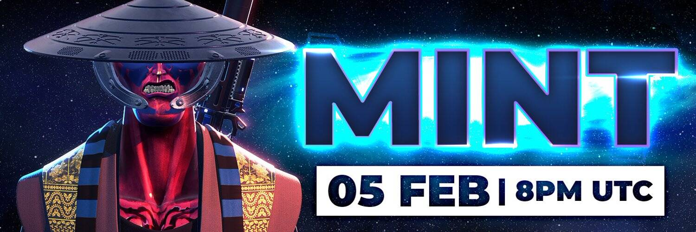

# Metavatars OfficiaI Collection

由野蛮的企业家和前育碧/奥术设计师发起。

1778 个允许玩 Metavatars 游戏的 NFT。

您拥有的 Metavatar 越多，您获得的 SAMA 就越多！

METAVATARS ORIGINS NFT - 常见问题（FAQ）
▶ 什么是 METAVATARS 起源？
METAVATARS ORIGINS 是一个 NFT（Non-fungible token）集合。存储在区块链上的数字艺术品集合。
▶ 有多少个 METAVATARS ORIGINS 代币？
总共有 1,776 个 METAVATARS ORIGINS NFT。目前，707 位所有者的钱包中至少有一个 METAVATARS ORIGINS NTF。
▶ 最昂贵的 METAVATARS ORIGINS 销售是什么？
出售的最昂贵的 METAVATARS ORIGINS NFT 是 METAVATARS #470。它于 2022 年 6 月 12 日（3 个月前）以 305 美元的价格售出。
▶ 最近卖出了多少 METAVATARS ORIGINS？
过去 30 天内共售出 19 个 METAVATARS ORIGINS NFT。
▶ METAVATARS ORIGINS 需要多少钱？
过去 30 天，最便宜的 METAVATARS ORIGINS NFT 销售额低于 96 美元，最高销售额超过 173 美元。过去 30 天 METAVATARS ORIGINS NFT 的中位价格为 127 美元。
▶ 什么是流行的 METAVATARS ORIGINS 替代品？
许多拥有 METAVATARS ORIGINS NFT 的用户还拥有 PROPERTY DEEDS、 DegenOkayBears、 EL NUMEROS和 WaterBe4nZuki。

