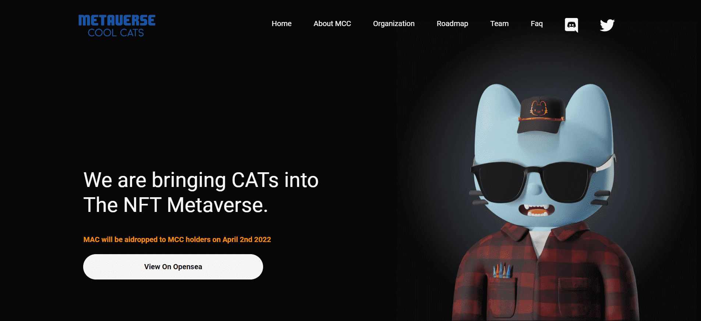

# Metaverse Cool Cats

METAVERSE，这个名字现在在加密领域不需要任何介绍，目前整个世界都在走向 VR，我们已经看到很多成功的项目在 metaverse 上，在 nft 市场上交易量超过 10k+，现在来到那些基于 Nfts猫在加密爱好者中非常受欢迎。

因此，我们将它们带到虚拟世界的想法使我们致力于这个项目，以获得 4,999/9999（5004 个已烧毁）MCC 手绘超逼真头像。我们想为我们的社区提供一只逼真的猫，因此 9 名团队成员花了 100 多天精心设计它们。可能我们是第一个将 Cats 带到 Metaverse 的团队。

