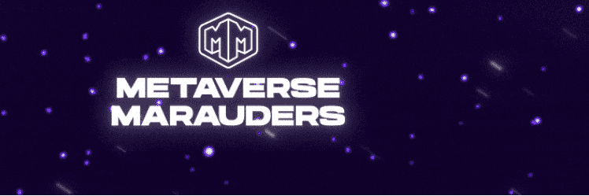

# Metaverse Marauders

Metaverse Marauders 是一个由 12,000 名冒险家组成的祖传公会，他们在 Nilmara Galaxy 广阔多样的星球上漫游，寻找最令人垂涎的宝藏和遗物。加入冒险💫

Metaverse Marauders NFT - 常见问题（FAQ）
▶ 什么是元界掠夺者？
Metaverse Marauders 是一个 NFT（不可替代令牌）集合。存储在区块链上的数字艺术品集合。
▶ 元界掠夺者代币有多少？
总共有 3,163 个 Metaverse Marauders NFT。目前，1,100 名所有者的钱包中至少有一个 Metaverse Marauders NTF。
▶ Metaverse Marauders 最昂贵的交易是什么？
出售的最昂贵的 Metaverse Marauders NFT 是 Marauder #1524。它于 2022-08-05（24 天前）以 70.3 美元的价格售出。
▶ 最近卖出了多少元界掠夺者？
过去 30 天内售出了 15 个 Metaverse Marauders NFT。
▶ 元界掠夺者需要多少钱？
过去 30 天，Metaverse Marauders NFT 最便宜的销售额低于 41 美元，最高销售额超过 70 美元。在过去 30 天内，Metaverse Marauders NFT 的中位价格为 49 美元。
▶ 什么是流行的 Metaverse Marauders 替代品？
许多拥有 Metaverse Marauders NFT 的用户还拥有 Stranger EggZ、 EL NUMEROS、 DegenOkayBears和 WaterBe4nZukis。

