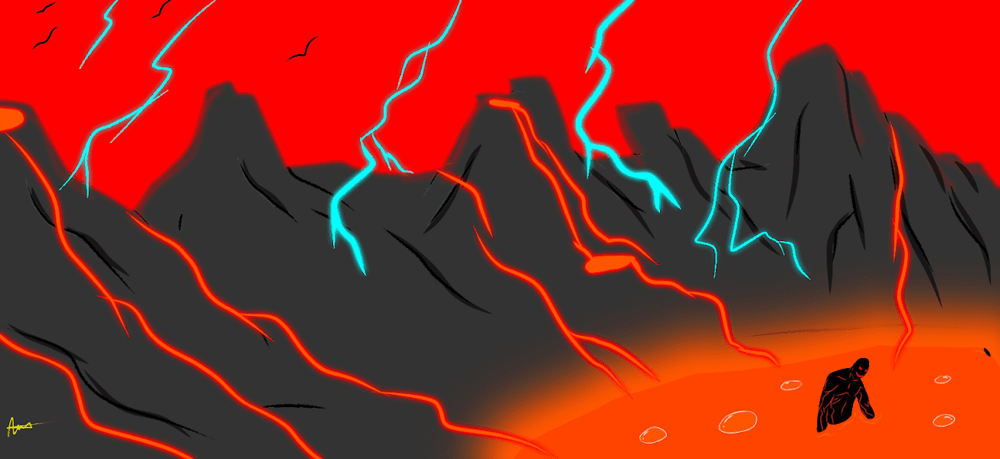

# Metaverse Protectors

元界保护者统计  创建于 7 个月前  8 代币供应  2.5% 费用
过去 7 天没有出售元界保护器。

在战争和灾难时期，保护者在这里提供帮助

Metaverse Protectors NFT - 常见问题（FAQ）
▶ 什么是元界保护者？
Metaverse Protectors 是一个 NFT（Non-fungible token）集合。存储在区块链上的数字艺术品集合。
▶ 元界保护者代币有多少？
总共有 8 个 Metaverse Protectors NFT。目前，1,050 名所有者的钱包中至少有一个 Metaverse Protectors NTF。
▶ 最近卖出了多少元界保护者？
过去 30 天内共售出 0 个 Metaverse Protectors NFT。

