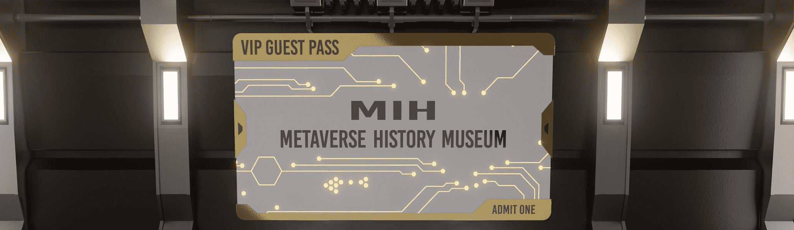

# MIH History Museum Meta Pass

MIH Metaverse 博物馆访客通行证是第一张数字创世票，适用于在收藏的第一个月铸造并持有 Last Supper NFT 的用户。

MIH 历史博物馆 Meta Pass NFT - 常见问题（FAQ）
▶ 什么是 MIH 历史博物馆元通行证？
MIH 历史博物馆 Meta Pass 是一个 NFT（不可替代代币）系列。存储在区块链上的数字艺术品集合。
▶ 有多少 MIH 历史博物馆 Meta Pass 代币？
总共有 1 个 MIH 历史博物馆 Meta Pass NFT。目前，677 位所有者的钱包中至少有一个 MIH 历史博物馆 Meta Pass NTF。
▶ 最近卖出了多少 MIH 历史博物馆 Meta Pass？
过去 30 天内共售出 0 个 MIH 历史博物馆 Meta Pass NFT。

