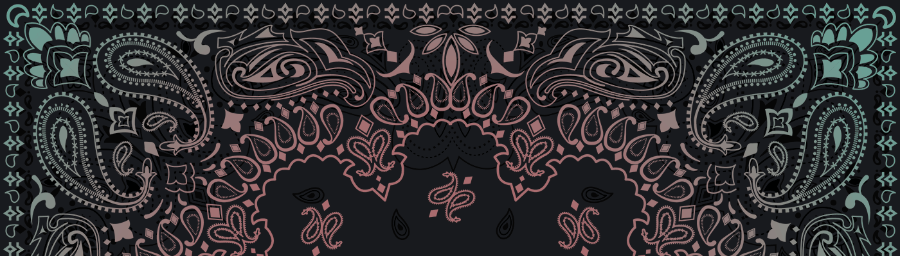

# MetaVoicers of Afghan

3,000 名各种稀有的手绘抗议者在以太坊区块链上放大了他们的声音。MetaVoicers 通过利用 NFT 的财务潜力并将其引导到致力于使世界变得更美好的组织，将艺术和对正义的热情相结合。

我们每个人都可以有所作为，但我们可以一起创造持久的改变。创建 MetaVoicers 是为了成为世界援助的来源：在 NFT 空间中，抗议者的艺术收藏品为更美好的明天而战；在现实世界中，筹集资金以改善生活。

\#50% 的铸币收益 + 100% 的转售版税将捐赠给 MV 社区选出的慈善组织。这意味着收集的抗议者越多——MetaVerse 的流通越多！——为你关心的事业直接产生的美元就越多！

