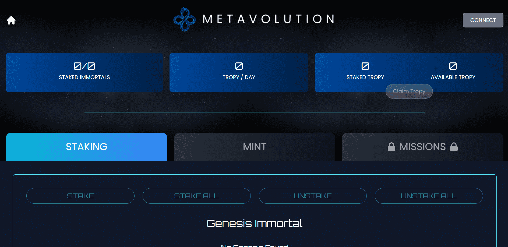

# MetaVolution: Immortals

▶ 什么是 MetaVolution：不朽？
MetaVolution: Immortals 是一个 NFT（非同质代币）集合。存储在区块链上的数字艺术品集合。
▶ 存在多少 MetaVolution: Immortals 代币？
总共有 850 个 MetaVolution: Immortals NFT。目前 124 位所有者的钱包中至少有一个 MetaVolution: Immortals NTF。
▶ 最昂贵的 MetaVolution: Immortals 销售是什么？
最昂贵的 MetaVolution: Immortals NFT 是 Metavolution Immortal #639。它于 2022 年 6 月 6 日（3 个月前）以 180 美元的价格售出。
▶ MetaVolution: Immortals 最近卖出了多少？
过去 30 天内售出了 79 个 MetaVolution: Immortals NFT。
▶ MetaVolution: Immortals 的费用是多少？
过去 30 天，最便宜的 MetaVolution: Immortals NFT 销售额低于 33 美元，最高销售额超过 191 美元。MetaVolution: Immortals NFT 的中位价格在过去 30 天内为 88 美元。
▶ 什么是流行的 MetaVolution: Immortals 替代品？
许多拥有 MetaVolution: Immortals NFT 的用户还拥有 MetaVolution: Obelisks、 Metavolution: Land、 Angels Oasis和 Ethernal Elves Sentinels。

