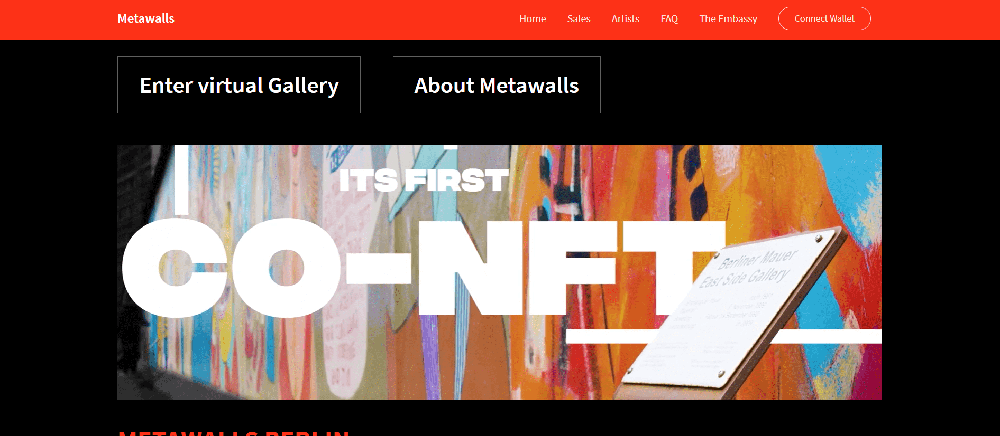

# Metawalls_CO-NFT

METAWALLS 是受柏林艺术家启发并为之打造的全新 NFT 平台。METAWALLS 将柏林充满活力的街头艺术文化带入元界和区块链世界。

METAWALLS 希望帮助改革艺术市场，这意味着我们通过我们革命性的 CO-NFT（集体所有权 NFT）平台促进艺术家和艺术买家的更多平等、参与和赋权。

CO-NFT 的独特设计和功能将使全球艺术爱好者社区能够以前所未有的方式支持和直接参与柏林独特的街头艺术文化。

METAWALLS 在 Polygon 上运行，这是一种节能的“股权证明”区块链。Polygon 24/7 全天候为用户提供安全、低成本的交易。

