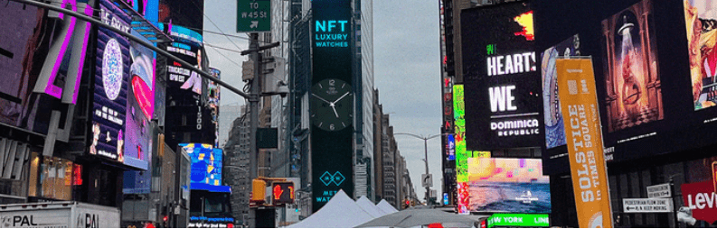

# MetaWatch x NFT.NYC

我们的社区对我们来说至关重要：我们希望将设计师和收藏家聚集在一起。我们在这里建立一个对手表、NFT 和 Metaverse 真正感兴趣的人的开放社区。

我们在这里留下来。我们想到的是几十年——而不是几个月。我们希望建立一个跨平台手表的全球奢侈品牌。

因此，我们的目标不是创建和销售一个单一的 NFT 集合。这只是一个开始。

我们前面还有很长的路要走。我们看到了如此多的潜力，并对未来有如此多的想法，并愿意与您一起制定路线图。但我们已经有一些里程碑想与您分享：我们将每年发布 2 个版本，每个版本都有一个特定的主题。

对于即将推出的系列，我们已经与来自两个世界的年轻流行设计师进行了接触：NFT 艺术家和奢侈手表设计师。如果您有兴趣加入该协会，请与我们联系。

一旦收集完成，我们将致力于 IPFS 存储等长期解决方案。

