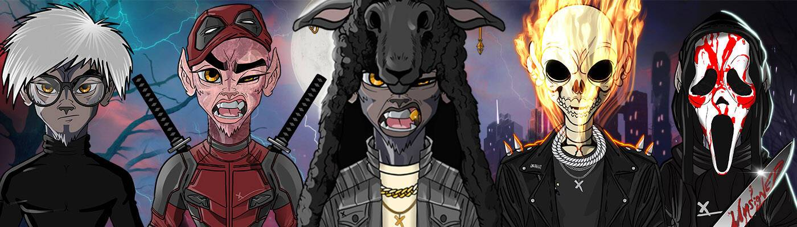

# MetaWolves by unsignedArtist NFT

Meta Wolves 是漫画书、服装系列、3D 化身的第一卷系列，它使用生成艺术引擎、区块链技术和智能合约架构来制作 4,444 个人作为狼进入 Metaverse 的史诗故事。从 PFP（个人资料图片）代币持有者开始，将获得来自同一集合的随机 3D MetaWolves 奖励，可在 Metaverse 中使用。

unsignedArtistNFT 是一个发布高级 NFT 收藏的团队。该团队由设计和艺术、技术和区块链、项目管理、营销和财务等所需领域的天才组成。

