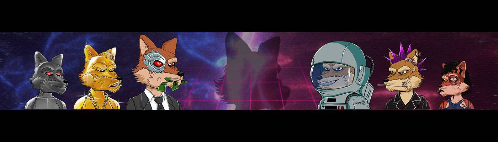

# Meta Wolves Club

欢迎来到元狼俱乐部；一个私人专属俱乐部，* 10.000 Wolves将在 Metaverse 中拥有独特的特权，作为早期投资者参与种子私人销售，接收空投并被邀请参加由MWC 团队在世界各地组织的在线和现场活动等等......！在我们的社交媒体上关注我们，随时了解最新消息加入 MWC。如果您进入 Crypto 领域，千万不要错过这一生的机会，不要做一只羊，*加入 MWC 的行列！

Meta Wolves Club NFT - 常见问题（FAQ）
▶ 什么是元狼俱乐部？
Meta Wolves Club 是一个 NFT（Non-fungible token）集合。存储在区块链上的数字艺术品集合。
▶ 有多少 Meta Wolves Club 代币？
总共有 983 个 Meta Wolves Club NFT。目前 490 位车主的钱包中至少有一个 Meta Wolves Club NTF。
▶ Meta Wolves Club 最近卖出了多少？
过去 30 天内售出 0 个 Meta Wolves Club NFT。
▶ 什么是流行的 Meta Wolves Club 替代品？
许多拥有 Meta Wolves Club NFT 的用户还拥有 CareBears Official、 MetaGods Celestial Pass、 Hustlers Of Wall Street*和 Bae Apes Official NFT。

