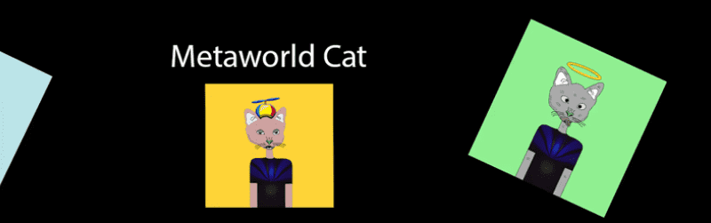

# Metaworld Cat

999 个随机生成的独特猫 NFT 的集合 - 生活在 Polygon 区块链上的独特数字收藏品。慈善 10% 给猫。

Metaworld Cat 是一个 metaverse 项目，查看我们的 twitter 以获取 metaverse 预览。

目前我们支持Solana、Ethereum、Avalanche、Fantom、Binance、Polygon 和 Stacks，并计划添加更多！

是的！所有 NFT 集合都符合元数据标准，并与所有流行的市场兼容。
使用您的 CandyMachineID（自动提供）申请在 SolSea 等热门市场上列出您的收藏！

一旦人们开始从您的收藏中铸造 NFT，以太坊/多边形
收藏就会立即出现在 OpenSea 上！

