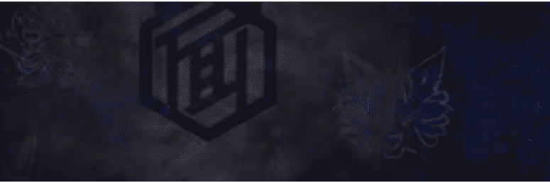

# MetaYomenClub icons

通过将我们的面具渗透到Web3 中，我们将实现创造新的 流行趋势 。 衣服、帽子、鞋子…… 有很多 真正的时尚单品，但没有“面具”。 我们将在元界中萌芽一种超越 现有框架的新文化。 世界应该再一次知道面具 的隐藏潜力。

文化发展意味着和平时期。 平安时代是
在日本历史上留下印记的文学繁荣时期。 然而，京都繁华的背后，却隐藏着不为人知的秘密 。

“ 和平”之所以可能，是因为有人保护它。
你受到什么保护？

“ 妖怪”威胁人的生命，被认为是万恶之源。

为了保护自己免受不断攻击他的怪物的伤害，最强的阴阳师 创造了一种可以封印怪物 的技术。 这使得即使是那些没有力量的人也可以消灭妖怪。 他们被称为 “ 魔术师”。

愿京都 城 里没有眼泪, 才能保持 和平. 与妖怪战斗的理由与人数一样多。为什么站在妖怪面前？ 不管是什么原因，应该移动的是你。 我要你封印所有妖怪，带来 “真正意义上的” “和平”。

