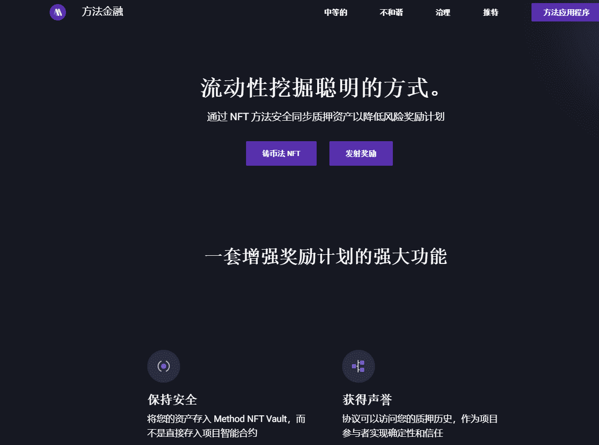

# MethodNFT

通过实验性智能合约将资金置于风险之中已成为过去。

使矿工能够通过将资产抵押到他们的 Method NFT 而不是直接进入您的奖励池来分散他们的资金。

与 Method NFT 的 Factory 合约的单一交互可实现通用访问。

所有携带 Method NFT 的参与者都将有资格开始获得您项目的奖励。

LP 为 Uniswap 等池或 Compound 等协议提供流动性，并获得 LP 代币作为回报。然后，LP 将把这些代币存入他们的 Method NFT Vault。然后，集成 UniversalVault 标准的协议可以将其流动性挖矿奖励存入 LP 的 NFT Vault。这是一种向 LP 提供流动性挖矿奖励的新方式，而无需强迫他们将资金存入协议自己的质押合约中。

将您的资产存入 Method NFT Vault，而不是直接存入项目智能合约。

