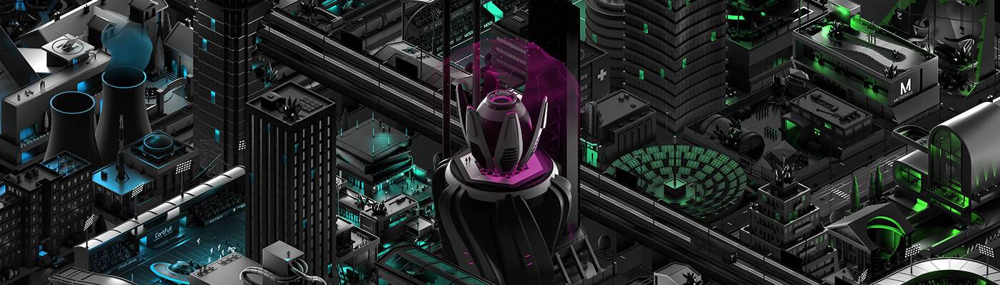

# Metroverse BIackout

Metroverse 是一款基于以太坊的土地交易 NFT 策略游戏。
收集、交易和质押您的城市街区以获得 $MET 实用代币。

Metroverse Blackout NFT - 常见问题（FAQ）
▶ 什么是 Metroverse 停电？
Metroverse Blackout 是一个 NFT（不可替代代币）集合。存储在区块链上的数字艺术品集合。
▶ 存在多少 Metroverse Blackout 代币？
总共有 10,000 个 Metroverse Blackout NFT。目前，2,424 位车主的钱包中至少有一个 Metroverse Blackout NTF。
▶ Metroverse Blackout 最昂贵的促销活动是什么？
售出的最昂贵的 Metroverse Blackout NFT 是 Block #15043。它于 2022 年 6 月 5 日（3 个月前）以 180 美元的价格售出。
▶ 最近卖出了多少 Metroverse Blackout？
过去 30 天内售出了 504 个 Metroverse Blackout NFT。
▶ Metroverse 停电需要多少费用？
在过去 30 天内，最便宜的 Metroverse Blackout NFT 销售额低于 201 美元，最高销售额超过 1136 美元。Metroverse Blackout NFT 的中位价格在过去 30 天内为 406 美元。
▶ 流行的 Metroverse Blackout 替代品有哪些？
许多拥有 Metroverse Blackout NFT 的用户还拥有 Metroverse Genesis、 Metroverse Pass、 Metroverse Genesis Mini和 Acrocalypse。

