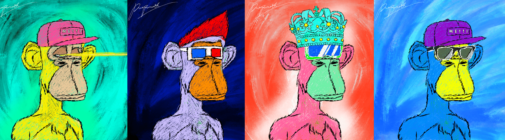

# MettiApe

世纪不断发展的艺术空间是由从机构艺术机构中撤离的，而是追求替代形式的表达形式。MettiForArtists 是由 Pumpametti 发起的开源智能合约，允许技术背景有限或没有技术背景的艺术家在自己的自定义合约上铸造 NFT 艺术品，而不是使用 OpenSea Storefront Contract。

使用 MettiForArtists，您可以以您的艺术家姓名铸造独特的艺术品，为您的独特艺术品设置不可撤销的艺术品链接，还可以设置艺术品版税。Pumpametti Discord dev-Chat 将提供更详细的教程和同伴帮助。任何艺术家都不应该因为技术障碍而挨饿。Metti Ape是艺术家Pumpametti的美术NFT系列，通过当代艺术的观点将猿文化并列。总共10000个metti猿。您必须拥有Metti艺术品或BAYC才能造成Metti猿。只有合同中的造币厂，您才能在Pumpametti网站上找到详细的铸造说明。

不隶属于无聊猿游艇俱乐部或 Yuga Labs。

