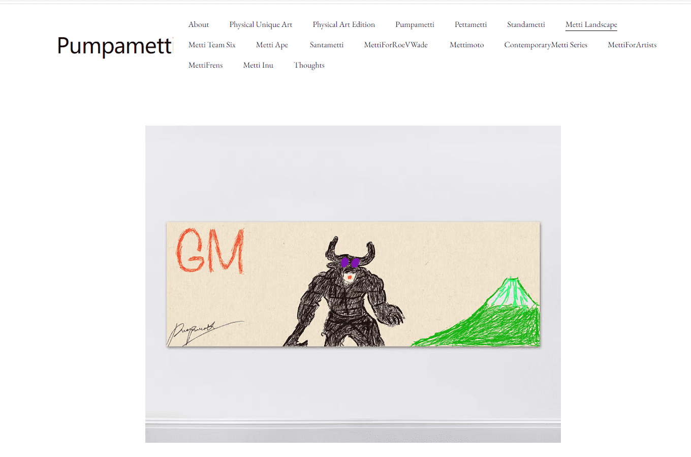

# Metti Landscape

Metti Landscape (MSCAPE) 是艺术家 Pumpametti 的美术横幅 NFT 收藏。这是艺术家的创世纪 NFT 横幅系列。

Metti Landscape 将于美国东部时间 2021 年 10 月 25 日下午 5 点揭晓。

Pumpametti 持有者终身免费铸币厂 Pettametti 持有者每铸币 0.03 eth Standametti 持币者每铸币 0.04 eth

每笔交易只有 1 个 Metti Landscape

Pumpa 持有者请选择“PumpaFirstChoiceVIPMint” Petta 持有者请选择“PettaVernissageMint” Standa 持有者请选择“StandaPrivateMint”

没有公共铸币厂，您必须拥有 Metti 才能铸造 Metti Landscape Only 铸币厂合同。

