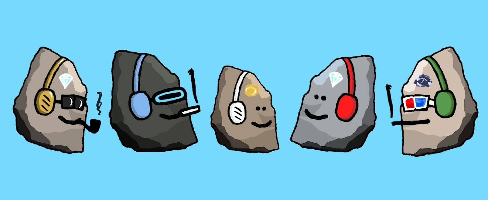

# Mfer Rocks

[官方合作] 石头现在可以在 mfersunited.com 上交易！

一小堆 696 块岩石被收养到有爱心的家庭！:D

- 每块石头 0.0369 ETH（👆它显示为 0.04，但实际上是 0.0369 铸造时）。
- 696 块岩石被采用。
- 每笔交易的最大铸币量 = 10 块石头。

🎁 [更多活动]
1) Rock-drop FEVER 2.0！
- 接下来铸造的 100 块石头（#360 到 #459）将参加 10 颗石头的抽奖活动！（10 名优胜者，每人 1 块摇滚）

2) Opensea 落石！
5x 落石：
- 2x 石头：每人 1 到 2 位超过 1 ETH 的列表 💎
- 3x 石头：给 3 个石头买家。 

石头可以变成月亮石吗？😉

