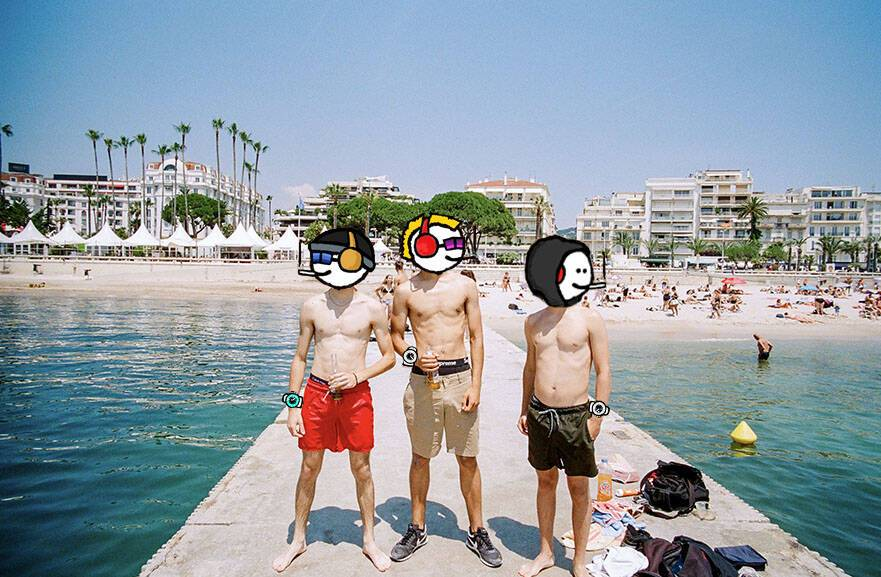

# mfers in - by pete halvorsen

创建于 5 个月前

2 代币供应

2.5% 费用

刷新

过去 7 天没有售出 mfers in - by pete halvorsen。

戛纳电影节，皮特·哈沃森（pete halvorsen）系列电影节的起源。

特别感谢我的 mfer sartoshi 让这成为可能。

“mfers in”的 2.5% 直接进入 unoficalmfer.eth 国库。

▶ 什么是 mfers in - by pete halvorsen？
mfers in - by pete halvorsen 是一个 NFT（非同质代币）集合。存储在区块链上的数字艺术品集合。
▶ 存在多少 mfers in - by pete halvorsen 代币？
pete halvorsen NFT 总共有 2 个 mfer。目前，12 位业主的钱包中至少有一个 mfers in - by pete halvorsen NTF。
▶ 最近售出了多少 mfers in - by pete halvorsen？
过去 30 天内售出 0 个 mfers in - by pete halvorsen NFT。
 交互式 NFT 项目：Goof

