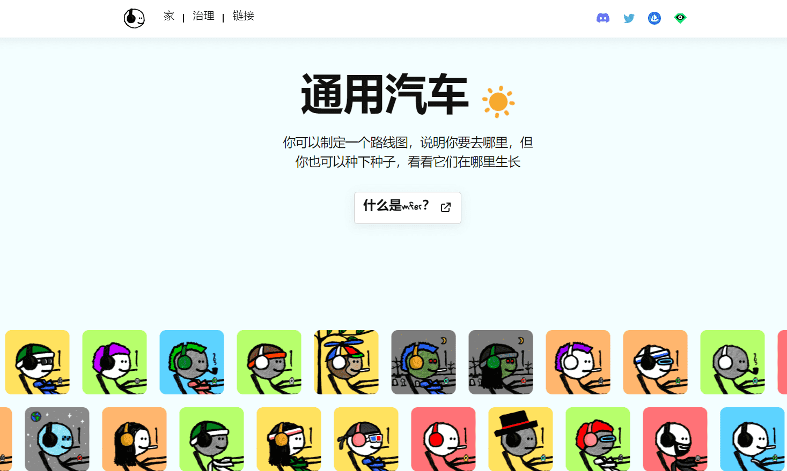

# mfers

你可以制定一个路线图，说明你要去哪里，但你也可以种下种子，看看它们在哪里生长。

加密朋克。爱他们，并且对 larva labs 在基本上没有蓝图的情况下创造的东西着迷。2021 年 4 月，我得到了我的第一个朋克一个带香烟的莫霍克朋克。sartoshi the cryptopunk 进入twitterverse。

我得到了一些朋克，因为我认为它们是一种被低估的投机资产而且我认为它们真他妈的甜——一旦我有拥有一个的感觉并且知道只有 10,000 个，我可以看到未来的潜在价值但我也认为也许交易它们也会很有趣，我每周都在买卖朋克，并且玩得很开心包括与 deeze 之类的一些竞标战和我认识的其他朋克持有者。

