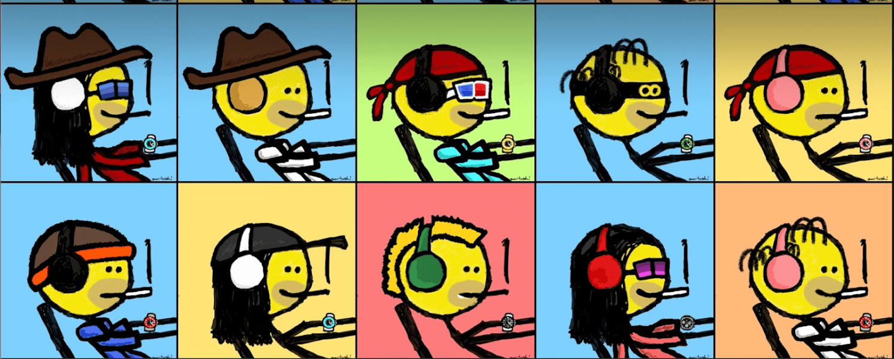

# mfersimpson

费辛普森统计
创建于 6 个月前
1,211 代币供应
6.9% 费用
过去 7 天没有售出任何 mfersimpson。

TheSimpsonZPunks 的创造者 Leonardo 向 Sartoshi Mfers 系列致敬。对于一个弗伦到一个弗伦，我无法抗拒。▶ 什么是 mfersimpson？
mfersimpson 是一个 NFT（非同质代币）集合。存储在区块链上的数字艺术品集合。
▶ 存在多少个 mfersimpson 代币？
总共有 1,211 个 mfersimpson NFT。目前，211 位所有者的钱包中至少有一个 mfersimpson NTF。
▶ 最近卖出了多少 mfersimpson？
过去 30 天内售出 0 个 mfersimpson NFT。

