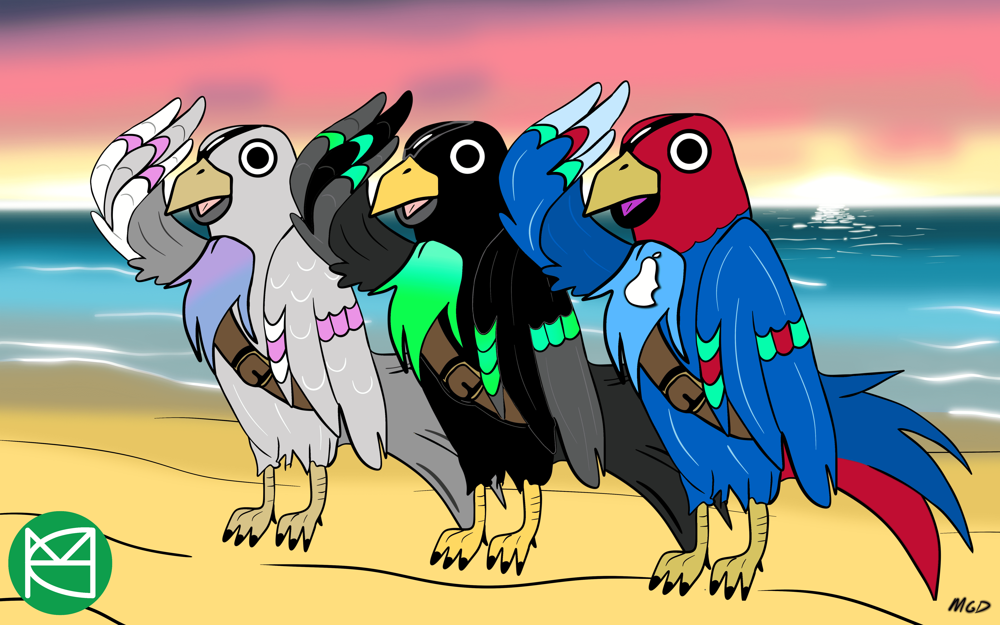

# MHC x MADGRADDAD

▶ 什么是集体通行证？
集体通行证是一个 NFT（不可替代）集合。在存储证链上的数字收藏品集合。
▶ 集体通行证代币有多少？
收藏有1个通行证，目前有21位的收藏中至少有一个通行证。
▶ 集体通行证最近了多少？
过去30个共售出0个Collect Pass NFT。
▶ 什么是流行的集体通行证替代品？
拥有 The Collective Pass NFT 的用户也拥有 UGLY BETTYS、Cayden 的 NFT！、ricecount 和 Dario De Siena Digital。

MHCollective 的限量版 NFT #1

MADGRADDAD 是一位才华横溢的双相情感障碍艺术家。

