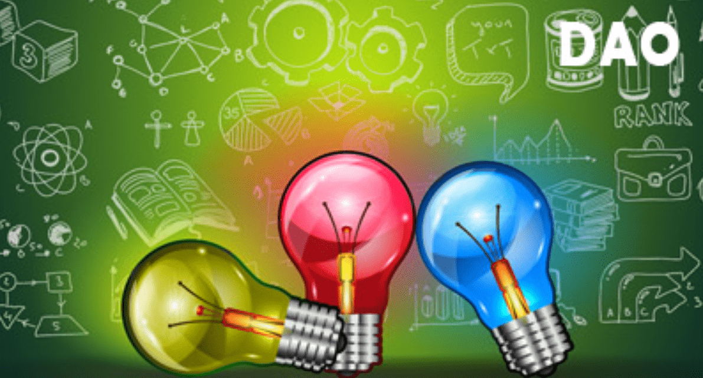

# MHE-META-PASS

ABCMETA.io是一个NFT资产铸造和交易的全球平台，项目提供“Bid-to-Earn”拍卖模式，是进入元界的全新入口。

参与“USDA流动性挖矿”的参与者将获得USDT的奖励。

参与者还将获得 10 个免费铸币厂 ABCMETA-ID，一个像素化的 NFT，并享受永久版税。

只需伸出手进入 ABCMETA。▶ 什么是 MHE-META-PASS？
MHE-MET-PASS 是一个 NFT（Non-fungible token）集合。在区块链上的数字收藏品存储集合。
▶ 有多少个MHE-META-PASS代币？
MHE-META-PASS N个。目前5、991个空格中至少有一个。
▶ 最贵的 MHE-META-PASS 销售的是什么？
出价最贵的 MHE-META-PASS NFT 是 AIRDROP-PASS（价格高达 5,000 USDT）。它在 2022-07-03（大约 2 个月前）以 5.3 美元的售出。
▶最近一次有多少-MHE-MET？
过去 30 条 NFT 卖出 - 1 条 MHE NMETA-PASS。

