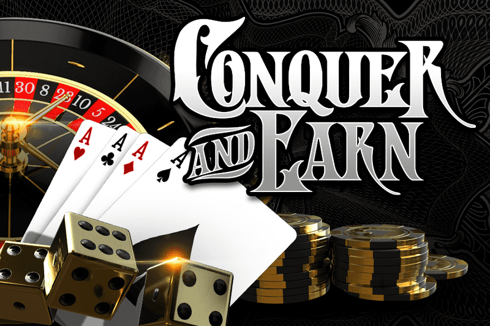

# MHM Official

Meta House Mafia 是一个由 5,000 个独特的 Mafia NFT 组成的独家成员组织，他们生活在以太坊区块链上。每个 Mafiosi 都允许其所有者投票支持由 Meta House Mafia 社区财政部支付的倡议和体验，并从 Metaverse 获得一定比例的收入。▶ 什么是MHM？
MHM Official 是 NFT（非同质代币）集合。存储在一条链上的数字收藏品集合。
▶ 存在多少 MHM 官方代币？
一个0位车主的钱包中至少有一个NTF。
▶ 最贵的 MHM 官方促销是什么？
出价最贵的 MHM Official NFT 是 Mafioso 684。它于 2022-06-19（2 个月前）以 329.3 美元的价格售出。
▶最近确切了多少 MHM Official
过去 30 个 MHM 卖出 16 个 NFT。
▶ MHM 中国的费用是多少？
过去过去 NFT 最便宜的 193 美元的 70 美元，超过 70 美元。MHM 官方 NFT 的价格在 30 天，为 30 美元，为 7 美元。
▶ 什么是流行的 MHM Official 替代品？
拥有 MHM Official NFT 的用户还拥有 Baby Medicated Mice、Fashion Dog Official NFT、The MetaSkulls 和 USFL Fan Pass。

