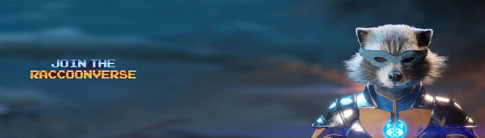

# mightyraccoon's

Mightyraccoon's 是一个与 ERC-721 网络相连的 NFT 集合，其中包含从数百万件衣服、配饰、眼镜、发型、背景对象和颜色变化中随机生成的 9999 个浣熊设计。 在 9999 个设计中，有 30 个是由我们的艺术家手动创建的。 ✌️我们的目标是贡献和多样化 NFT 世界并支持数字平台。 我们的主要目的是创新和扩展元宇宙！ 👾

“mightyraccoon”的 NFT - 常见问题（FAQ）
▶ 什么是“强大的浣熊”？
“mightyraccoon's”是一个 NFT（非同质代币）集合。存储在区块链上的数字艺术品集合。
▶ 存在多少“mightyraccoon”代币？
总共有 219 个“mightyraccoon”的 NFT。目前，106 位所有者的钱包中至少有一个“mightyraccoon”NTF。
▶ 最近卖了多少“mightyraccoon”？
过去 30 天内售出了 0 个“mightyracoon's”NFT。

