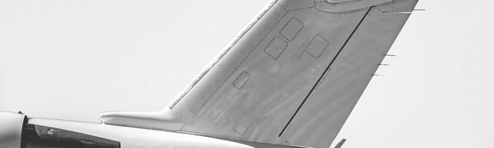

# Migrating Journey

飞机不是真正的鸟，但仍然在飞翔和雄伟……这张照片在很多方面都有一个很好的故事，原因如下：-这张照片是从直升机上在一个有效的机场拍摄的，让我可以飞越工作飞机并拍摄几乎 我想要什么。-在 2020 年“国际 B&W 蜘蛛奖”中获得第 5 名。-它是一个动画作品与一个用于增强现实的实体作品配对，您可以使用提供的高质量文件自行打印 .通过手机查看时，动画会覆盖在物理打印上。
这是示例视频：
https://youtube.com/shorts/BFZCeuyEUsc?feature=share 当我开始为这件作品制作动画时，它赋予了它第二次生命，提高了我的创造力，对我来说，在物理艺术和数字艺术之间架起了一座桥梁。

迁移之旅 NFT - 常见问题 (FAQ)
▶ 什么是迁移之旅？
Migrating Journey 是一个 NFT（Non-fungible token）集合。存储在区块链上的数字艺术品集合。
▶ 有多少 Migrating Journey 代币？
总共有 2 个 Migrating Journey NFT。目前，29 位所有者的钱包中至少有一个 Migrating Journey NTF。
▶ 最昂贵的 Migrating Journey 促销活动是什么？
最昂贵的 Migrating Journey NFT 是 Migrating Journey 2。它于 2022 年 6 月 20 日（2 个月前）以 22 美元的价格售出。
▶ 最近卖出了多少迁移之旅？
过去 30 天内售出了 1 个 Migrating Journey NFT。
▶ 什么是流行的 Migrating Journey 替代方案？
许多拥有 Migrating Journey NFT 的用户还拥有 Seb 版本、 AGYAAT LIMITED EDITIONS、 Gummo Land Limited Editions和 Janus Luk Editions。

