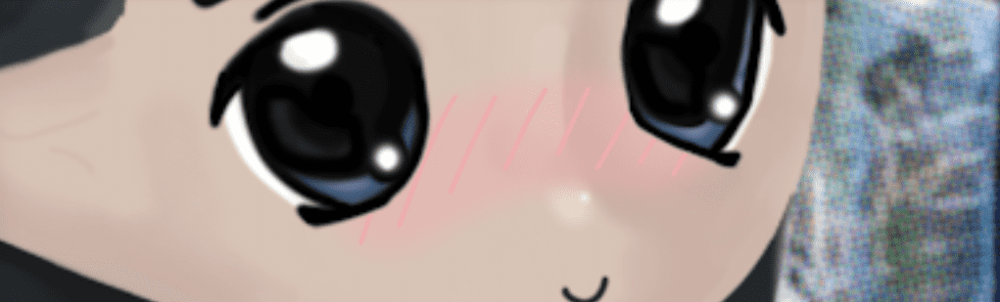

# Milady, That B.I.T.C.H.

欢迎来到 Milady Maker！——ゆっくりしていってね！
Milady Maker 是 10,000 个生成 pfpNFT 的集合，具有受街头风格部落启发的新奇比美学。

细节：
头像优先设计：从一开始就进行插图，以确保强大的社交媒体形象美学，并强调时尚。与计划的生成 NFT Header相关联。
连锁滚动功能：随机化的化妆品被组织成 不同的风格主题，有机会连续一代坚持相同的主题，旨在有机地产生审美连贯性。
为 Drip 分级： Milady's 在 各种加权指标上对徽章进行了排名，为投机市场增加了客观特征稀缺性之外的额外层次。
Neochibi Aesthetic：由数字画家 Milady Sonora以她独特的童趣动画插图创作的所有艺术作品。
Milady Village：仅限会员的 Discord 社区和指定的启动板，用于 扩展 Milady 项目，例如生成式 NFT 横幅和混音带系列。

