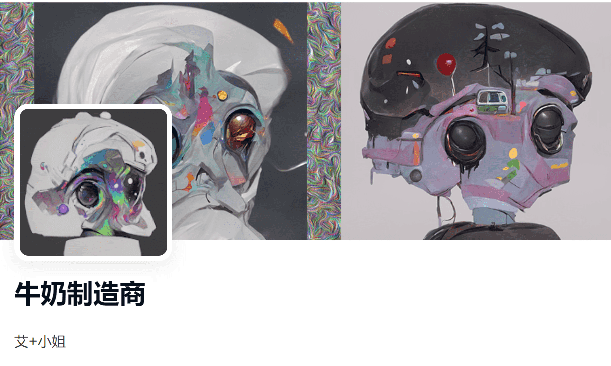

# milAIdy maker

milAIdy maker NFT 在过去 7 天内售出 11 次。milAIdy maker 的总销售额为 528.04 美元。一家milAIdy制造商NFT的平均价格为48美元。有 128 位 milAIdy maker 所有者，总共拥有 333 个代币。

什么是牛奶制造商？

milAIdy maker 是一个 NFT（Non-fungible token）集合。存储在区块链上的数字艺术品集合。

 milAIdy maker 代币有多少？

总共有 333 个 milAIdy maker NFT。目前，128 位所有者的钱包中至少有一个 milAIdy 制造商 NTF。

最近卖出了多少台milAIdy maker？

过去 30 天内售出了 23 个 milAIdy maker NFT。

MilAIdy 制造商的成本是多少？

过去 30 天，最便宜的 milAIdy 制造商 NFT 销售额低于 38 美元，最高销售额超过 148 美元。过去 30 天，milAIdy 制造商 NFT 的中位数价格为 71 美元。

