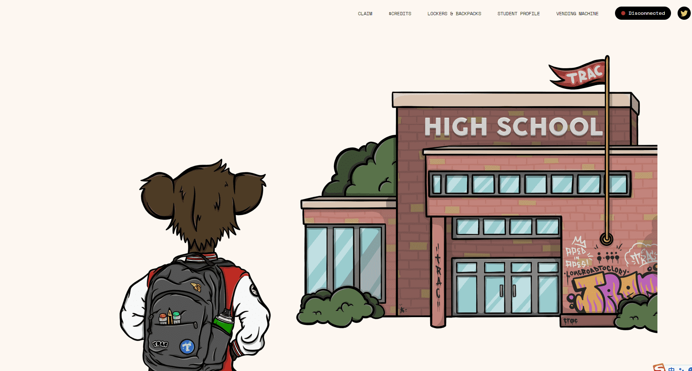

# Teen Rebel Ape Club - Milk Serums

Milk Serums 用于铸造 Teen Rebel Ape Club (TRAC) NFT。TRAC 是 8,888 只幼猿的集合，它们来自摄入这些放射性血清后的婴儿。Teen Rebel Ape Club 将于 22 年 1 月 22 日推出，虽然您可以兑换血清以获得 TRAC 猿，但牛奶血清不会过期并且可以无限期保留。

每种类型的牛奶血清都对应一个特定的稀有类别 TRAC。类别如下，按稀有程度排列：在使用牛奶血清铸造 TRAC 后，血清会被燃烧，作为交换，您将获得一个 Teen Rebel Ape Club NFT。

