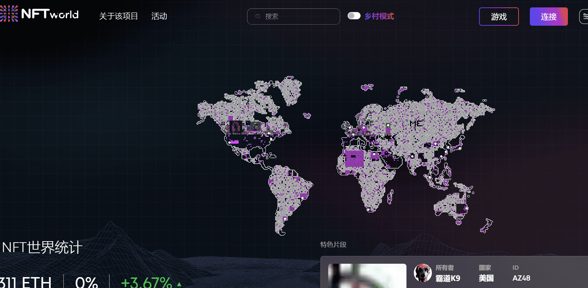

# MillionPieces

10,000 件独特的作品，来自 163 个国家和 20 个城市。拥有并共同创建#metaverse。$PIECE 于 8 月 2 日空投。NFT 世界由在以太坊区块链上创建的10,000 个单独的“片段”组成。作品遍布 163 个国家和 20 个城市。通过拥有一块，您可以通过在您的区域内上传和显示图像，与成千上万的其他人共同创建 NFT 世界元宇宙。

NFT 世界就 在这里。收集稀有物品，创建大量引人注目的图像，并加入一个与众不同的社区......

这只是开始。

加入我们精彩的 Discord 社区并在 Twitter 上关注我们以获取最新消息并保持最新状态。

