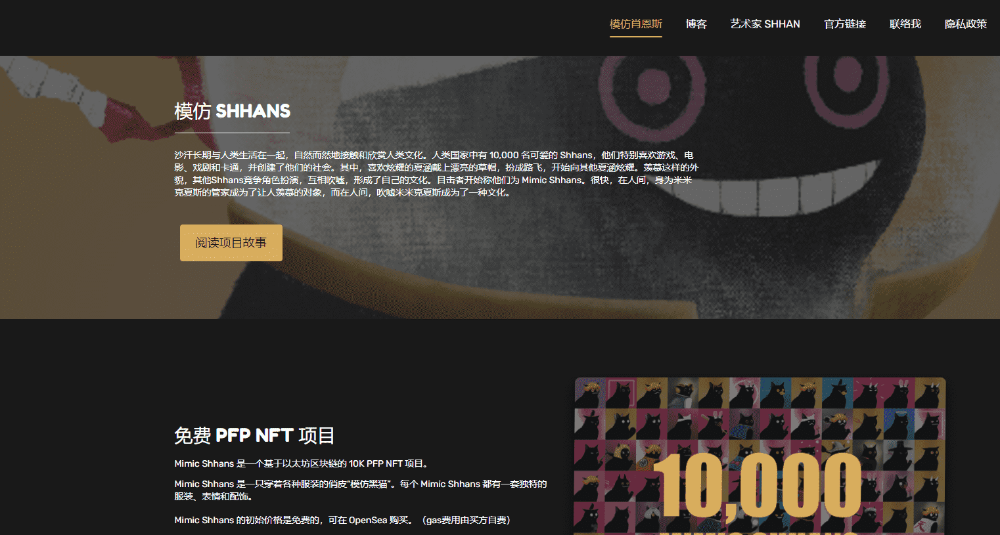

# Mimic Shhans Luna

Mimic Shhans Luna是MS的二次开发。从合约铸造。

沙汗长期与人类生活在一起，自然而然地接触和欣赏人类文化。人类国家中有 10,000 名可爱的 Shhans，他们特别喜欢游戏、电影、戏剧和卡通，并创建了他们的社会。其中，喜欢炫耀的夏涵戴上漂亮的草帽，扮成路飞，开始向其他夏涵炫耀。羡慕这样的外貌，其他Shhans竞争角色扮演，互相吹嘘，形成了自己的文化。目击者开始称他们为 Mimic Shhans。很快，在人间，身为米米克夏斯的管家成为了让人羡慕的对象，而在人间，吹嘘米米克夏斯成为了一种文化。

Mimic Shhans 是一个基于以太坊区块链的 10K PFP NFT 项目。

Mimic Shhans 是一只穿着各种服装的俏皮“模仿黑猫”。每个 Mimic Shhans 都有一套独特的服装、表情和配饰。 

Mimic Shhans 的初始价格是免费的，可在 OpenSea 购买。（gas费用由买方自费）

