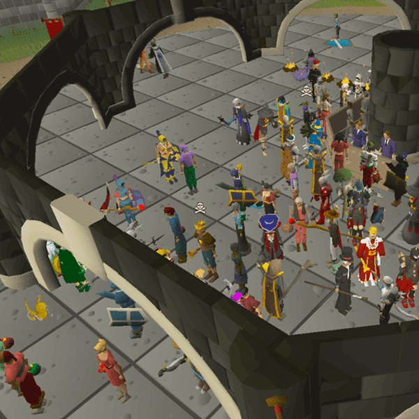

# mimories

嘿：3 我的记忆，都在区块链上。 请珍惜他们<3 灵感来自我最喜欢的项目：milady maker 过去 7 天内没有售出任何模拟物。 我很快就会减少供应！ 当前持有者将获得我未来项目的白名单

mimories NFT - 常见问题（FAQ）
▶ 什么是记忆？
mimories 是一个 NFT（不可替代令牌）集合。存储在区块链上的数字艺术品集合。
▶ 有多少个 mimories 代币？
总共有 1,686 个 mimories NFT。目前 259 位所有者的钱包中至少有一个模仿 NTF。
▶ 最近卖了多少mimories？
过去 30 天内售出 0 个 mimories NFT。

