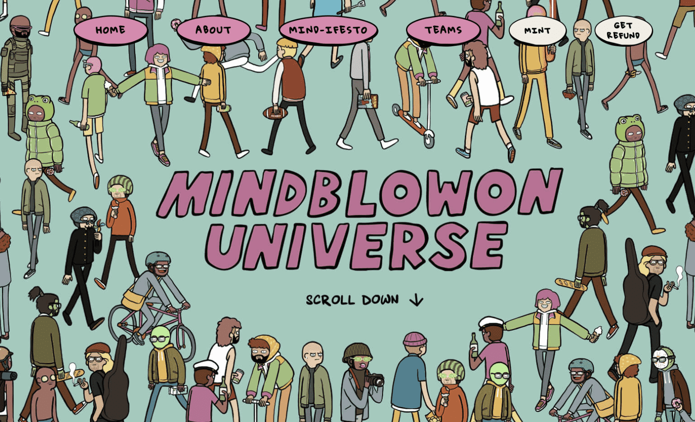

# Mindblowon Universe

元节中 6969 名怪人的另一个 Mindblowon 日，来自 Mindblowon 工作室的 Lickpalik 的 Tahilalats 的创建者。加入我们，踏上一段奇特但幸福的旅程，前往一个充满想象力和欢笑的新宇宙。让我们开始吧！▶ 什么是 Mindblowon 宇宙？

Mindblowon Universe 是一个 NFT（不可替代代币）集合。存储在区块链上的数字艺术品集合。

有多少 Mindbloon Universe 代币？

总共有 6,969 个 Mindblowon Universe NFT。目前，3,829 名所有者的钱包中至少有一个 Mindbloon Universe NTF。

Mindblowon Universe 最昂贵的销售是什么？

售出的最昂贵的 Mindblowon Universe NFT 是 [Sweet 'n Sour #4161](https://www.nft-stats.com/asset/0xcb2411c2b914b000ad13c86027222a797983ef2d/4161)。它于 2022 年 6 月 22 日（2 个月前）以 160 美元的价格售出。

最近卖出了多少部 Mindbloon Universe？

过去 30 天内售出了 592 个 Mindbloon Universe NFT。

Mindblowon Universe 的成本是多少？

在过去 30 天内，Mindbloon Universe NFT 最便宜的销售额低于 109 美元，最高销售额超过 251 美元。Mindbloon Universe NFT 的中位价格在过去 30 天内为 132 美元。

