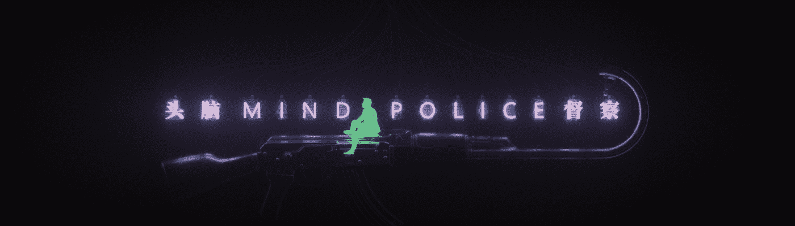

# MIND POLICE

一个由无限增发的且毫无赋能的视觉艺术组成的集合，具有千篇一律的胡言乱语和反复炒冷饭的不稀有性特征。三比一的宽幅比例除了碰巧与个别社交媒体的横幅一致，也是为了方便持有者打印出来贴在门上当横批，为你家门头赋能。 更重要的是，每一幅作品都可以解锁私人俱乐部“404休息室”的会员资格。（注：不持有也同样可以解锁会员资格，是不是很牛批） 你持有的时间越长，归零的可能性就越大。我们称其为道德持仓 —— 因为，很明显，你在与庄共舞。

一个视觉艺术收藏，总供应量与我想发行的一样多，由绝对零实用程序提供支持，其特点是各种胡言乱语和反复重复的特征。 3:1 的长宽比，巧合地与一些社交媒体横幅相同，也是为了让持有者更容易将它们打印在卫生纸上，这样卫生纸就可以被赋予实用性。 更重要的是，《心灵警察》系列的每一件都解锁了私人俱乐部“404 Lounge”的会员资格（*不持有也解锁会员，哈哈。）持有的时间越长，底价越有可能下降到 零。 我们称之为“Ethical HODL”——因为很明显，你在和 ZHUANG 一起跳舞。

