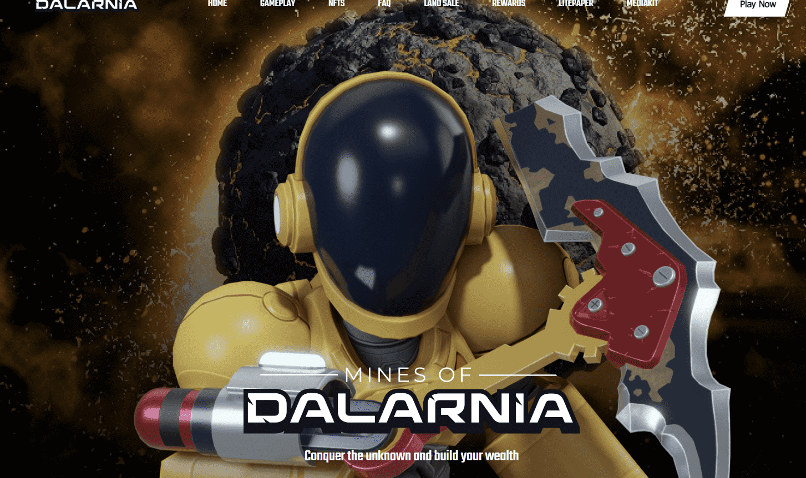

# Mines of Dalarnia Mining Apes Collection

游戏故事
现在是11752年。元星系团统治着大部分已知的系统。一个仁慈但不可理解的A.I.被称为唯一的思想指导着集体，确保和平与繁荣。Onemind公布了一项革命性的新技术：地球化胶囊。这些胶囊使行星在几秒钟内自发地经历数百万年的进化。在一个叫做达拉尼亚的扇区中的三颗行星被选中进行第一波地球化实验。来自银河系各地的人们涌向新改造的行星，在太空淘金热中寻找他们的财富。作为这些充满希望的矿工中的一员，你已经花了毕生积蓄去了这个系统外围的月球旅行。你准备好在达拉尼亚矿区发家致富了吗

